# Export Genius 브라우저 자동화 순서도

이 문서는 프로그램 내부 구조가 아니라, 자동화가 Export Genius 브라우저 화면을 이동하고 판단하는 순서를 설명한다.

```mermaid
flowchart TD
    START([자동화 시작]) --> TASK[현재 작업 확인<br/>업체명 · HS코드 · USD 범위 · 목표 수량]
    TASK --> OPEN[Export Genius 검색 결과 화면 확인]

    OPEN --> CLEAR[기존 검색 조건 모두 제거]
    CLEAR --> APPLY[조회 기간 · HS코드 · USD 범위 적용]
    APPLY --> VERIFY{적용된 조건이<br/>요청값과 정확히 같은가?}
    VERIFY -- 아니오 --> RETRY{조건 설정을<br/>3회 시도했는가?}
    RETRY -- 아니오 --> CLEAR
    RETRY -- 예 --> STOP_FILTER([조건 설정 오류로 중단])
    VERIFY -- 예 --> IMPORTERS[바이어 목록 열기]

    IMPORTERS --> SAVED{기존 저장 파일이 있는가?}
    SAVED -- 아니오 --> FIRST[1번 바이어부터 시작]
    SAVED -- 예 --> RESUME_PAGE[마지막 파일 번호로<br/>예상 페이지 이동]
    RESUME_PAGE --> LIST_MATCH{목록에서 마지막 파일명과<br/>같은 바이어명이 보이는가?}

    LIST_MATCH -- 예 --> ANCHOR_PROFILE[해당 바이어 상세페이지 진입]
    ANCHOR_PROFILE --> ANCHOR_NAME{상세페이지 회사명도<br/>마지막 파일명과 같은가?}
    ANCHOR_NAME -- 예 --> AFTER_ANCHOR[해당 바이어의 다음 번호부터 시작]
    ANCHOR_NAME -- 아니오 --> STOP_ANCHOR([이어하기 기준 불일치로 중단])

    LIST_MATCH -- 아니오 --> SEQUENTIAL[예상 번호부터 순서대로<br/>상세페이지 회사명 확인]
    SEQUENTIAL --> FOUND_ANCHOR{마지막 파일명과<br/>같은 회사명을 찾았는가?}
    FOUND_ANCHOR -- 예 --> AFTER_ANCHOR
    FOUND_ANCHOR -- 아니오 --> MORE_ANCHOR{확인할 바이어나<br/>다음 페이지가 있는가?}
    MORE_ANCHOR -- 예 --> SEQUENTIAL
    MORE_ANCHOR -- 아니오 --> STOP_RESUME([이어하기 위치를 찾지 못해 중단])

    FIRST --> SELECT
    AFTER_ANCHOR --> SELECT

    SELECT[현재 번호의 바이어 선택] --> PROFILE[상세페이지 진입]
    PROFILE --> READY{회사명 · 연간 수입액 · 연간 수입 건수가<br/>안정적으로 표시됐는가?}
    READY -- 아니오 --> PROFILE_FAIL[상세페이지 확인 실패 기록]
    READY -- 예 --> COMMODITY[Import Commodities 확인]

    COMMODITY --> HS_EXISTS{대상 HS코드가 있는가?}
    HS_EXISTS -- 아니오 --> NOT_QUALIFIED[조건 미달 처리]
    HS_EXISTS -- 예 --> SHARE{해당 HS코드 비중이<br/>5%를 초과하는가?}
    SHARE -- 아니오 --> NOT_QUALIFIED
    SHARE -- 예 --> COLLECT[회사 · 국가 · 품목 정보 수집]

    COLLECT --> DATA_OK{필수 정보를 모두<br/>확인했는가?}
    DATA_OK -- 아니오 --> DATA_FAIL[정보 확인 실패 기록]
    DATA_OK -- 예 --> SAVE[엑셀 저장]
    SAVE --> SAVE_OK{엑셀 저장이<br/>실제로 확인됐는가?}
    SAVE_OK -- 아니오 --> STOP_SAVE([저장 오류로 작업 중단])
    SAVE_OK -- 예 --> COUNT[저장 완료 수량 증가]

    PROFILE_FAIL --> BACK
    NOT_QUALIFIED --> BACK
    DATA_FAIL --> BACK
    COUNT --> TARGET{목표 수량을 달성했는가?}
    TARGET -- 아니오 --> BACK
    TARGET -- 예 --> TASK_DONE[현재 작업 완료]

    BACK[바이어 목록으로 돌아가기] --> RESTORE[처리하던 페이지와<br/>다음 바이어 번호 복원]
    RESTORE --> LIST_READY{바이어 목록이<br/>정상적으로 보이는가?}
    LIST_READY -- 아니오 --> RECORD_RECOVERY
    LIST_READY -- 예 --> NEXT_ROW{현재 페이지에<br/>다음 바이어가 있는가?}
    NEXT_ROW -- 예 --> SELECT
    NEXT_ROW -- 아니오 --> NEXT_PAGE{다음 페이지가 있는가?}
    NEXT_PAGE -- 예 --> MOVE_NEXT[다음 페이지 이동]
    MOVE_NEXT --> LIST_READY
    NEXT_PAGE -- 아니오 --> STOP_NO_MORE([목표 달성 전 목록 종료])

    RECORD_RECOVERY[현재 페이지와 다음 바이어 번호 기억<br/>페이지 새로고침] --> RELOAD[검색 결과 1페이지 표시]
    RELOAD --> RESTORE_PAGE[기억한 목표 페이지로 다시 이동]
    RESTORE_PAGE --> RECOVERED{목표 페이지의 바이어 목록이<br/>정상적으로 표시됐는가?}
    RECOVERED -- 예 --> NEXT_ROW
    RECOVERED -- 아니오 --> RECOVERY_LIMIT{새로고침 복구를<br/>3회 시도했는가?}
    RECOVERY_LIMIT -- 아니오 --> RECORD_RECOVERY
    RECOVERY_LIMIT -- 예 --> STOP_RECORD([목록 복구 실패로 중단])

    TASK_DONE --> MORE_TASK{다음 작업이 있는가?}
    MORE_TASK -- 예 --> TASK
    MORE_TASK -- 아니오 --> FINISH([전체 자동화 완료])

    USER_STOP([사용자 중단 요청]) -. 각 이동·대기 단계에서 확인 .-> STOP_USER([현재 진행을 멈추고 종료])
```

## 핵심 순회 원칙

1. 새 작업을 시작할 때는 이전 검색 조건을 모두 지우고 새 조건을 검증한 뒤 바이어 목록을 연다.
2. 이어하기는 엑셀 파일 번호만 믿지 않고, 목록명과 상세페이지 회사명을 이용해 마지막 위치를 확인한다.
3. 각 바이어는 상세페이지가 충분히 표시된 후 HS코드 존재 여부와 비중 조건을 먼저 확인한다.
4. 조건을 통과한 바이어만 나머지 정보를 수집하고, 실제 엑셀 저장이 확인되어야 저장 수량을 증가시킨다.
5. 상세페이지에서 목록으로 돌아오면 처리하던 페이지와 다음 바이어 번호를 다시 복원한다.
6. 목록이 비정상적으로 비면 새로고침 후 목표 페이지를 복원하며, 누적 3회 실패하면 중단한다.
7. 현재 작업의 목표 수량을 달성한 뒤에만 조건을 초기화하고 다음 작업으로 넘어간다.

